# awesome-text-summarization

The guide to tackle with the Text Summarization. 

* [Motivation](#motivation)
* [Task Definition](#task-definition)
* [Basic Approach](#basic-approach)
  * [Extractive](#extractive)
  * [Abstractive](#abstractive)
* [Combination Approach](#combination-approach)
* [Transfer Learning](#transfer-learning)
* [Evaluation](#evaluation)
* [Resources](#resources)
  * [Datasets](#datasets)
  * [Libraries](#libraries)
  * [Articles](#articles)
  * [Papers](#papers)

## Motivation

To take the appropriate action, we need latest information.  
But on the contrary, the amount of the information is more and more growing. There are many categories of information (economy, sports, health, technology...) and also there are many sources (news site, blog, SNS...).

  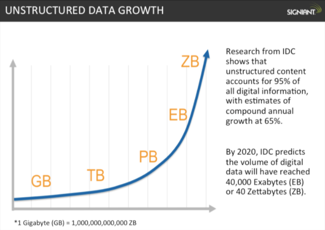
  
<i>
    from <a href="https://www.signiant.com/articles/file-transfer/the-historical-growth-of-data-why-we-need-a-faster-transfer-solution-for-large-data-sets/" target="_blank">THE HISTORICAL GROWTH OF DATA: WHY WE NEED A FASTER TRANSFER SOLUTION FOR LARGE DATA SETS</a>
  </i>

So to make an automatically & accurate summaries feature will helps us to **understand** the topics and **shorten the time** to do it.

## Task Definition

Basically, we can regard the "summarization" as the "function" its input is document and output is summary. And its input & output type helps us to categorize the multiple summarization tasks.

* Single document summarization
  * *summary = summarize(document)*
* Multi-document summarization
  * *summary = summarize(document_1, document_2, ...)*

We can take the query to add the viewpoint of summarization.

* Query focused summarization
  * *summary = summarize(document, query)*

This type of summarization is called "Query focused summarization" on the contrary to the "Generic summarization". Especially, a type that set the viewpoint to the "difference" (update) is called "Update summarization".

* Update summarization
  * *summary = summarize(document, previous_document_or_summary)*

And the *"summary"* itself has some variety.

* Indicative summary
  * It looks like a summary of the book. This summary describes what kinds of the story, but not tell all of the stories especially its ends (so indicative summary has only partial information).
* Informative summary
  * In contrast to the indicative summary, the informative summary includes full information of the document.
* Keyword summary
  * Not the text, but the words or phrases from the input document.
* Headline summary
  * Only one line summary.

**Discussion**

`Generic summarization` is really useful? Sparck Jones argued that summarization should not be done in a vacuum, but rather done according to the purpose of summarization ([2](https://www.cl.cam.ac.uk/archive/ksj21/ksjdigipapers/summbook99.pdf)). She argued that generic summarization is not necessary and in fact, wrong-headed. On the other hand, the headlines and 3-line summaries in the newspaper helps us.

## Basic Approach

There are mainly two ways to make the summary. Extractive and Abstractive.

### Extractive

* Select relevant phrases of the input document and concatenate them to form a summary (like "copy-and-paste").
  * Pros: They are quite robust since they use existing natural-language phrases that are taken straight from the input.
  * Cons: But they lack in flexibility since they cannot use novel words or connectors. They also cannot paraphrase like people sometimes do.

Now I show the some categories of extractive summarization.

#### Graph Base

The graph base model makes the graph from the document, then summarize it by considering the relation between the nodes (text-unit). `TextRank` is the typical graph based method.

**[TextRank](https://web.eecs.umich.edu/~mihalcea/papers/mihalcea.emnlp04.pdf)**

TextRank is based on [PageRank](https://en.wikipedia.org/wiki/PageRank) algorithm that is used on Google Search Engine. Its base concept is "The linked page is good, much more if it from many linked page". The links between the pages are expressed by matrix (like Round-robin table). We can convert this matrix to transition probability matrix by dividing the sum of links in each page. And the page surfer moves the page according to this matrix.

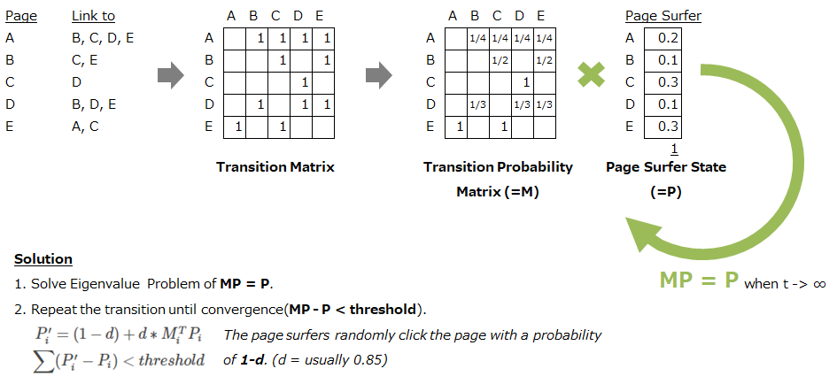
*Page Rank Algorithm*

TextRank regards words or sentences as pages on the PageRank. So when you use the TextRank, following points are important.

* Define the "text units" and add them as the nodes in the graph.
* Define the "relation" between the text units and add them as the edges in the graph.
  * You can set the weight of the edge also.

Then, solve the graph by PageRank algorithm. [LexRank](https://www.cs.cmu.edu/afs/cs/project/jair/pub/volume22/erkan04a-html/erkan04a.html) uses the sentence as node and the similarity as relation/weight (similarity is calculated by IDF-modified Cosine similarity).

If you want to use TextRank, following tools support TextRank.

* [gensim](https://radimrehurek.com/gensim/summarization/summariser.html)
* [pytextrank](https://github.com/ceteri/pytextrank)

#### Feature Base

The feature base model extracts the features of sentence, then evaluate its importance. Here is the representative research.

[Sentence Extraction Based Single Document Summarization](http://oldwww.iiit.ac.in/cgi-bin/techreports/display_detail.cgi?id=IIIT/TR/2008/97)

In this paper, following features are used.

* Position of the sentence in input document
* Presence of the verb in the sentence
* Length of the sentence
* Term frequency 
* Named entity tag NE
* Font style

...etc. All the features are accumulated as the score.

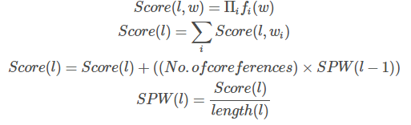

The `No.of coreferences` are the number of pronouns to previous sentence. It is simply calculated by counting the pronouns occurred in the first half of the sentence. So the Score represents the reference to the previous sentence.

Now we can evaluate each sentences. Next is selecting the sentence to avoid the duplicate of the information. In this paper, the same word between the new and selected sentence is considered. And the refinement to connect the selected sentences are executed.

[Luhn’s Algorithm](http://courses.ischool.berkeley.edu/i256/f06/papers/luhn58.pdf) is also feature base. It evaluates the "significance" of the word that is calculated from the frequency.

You can try feature base text summarization by [TextTeaser](https://github.com/MojoJolo/textteaser) ([PyTeaser](https://github.com/xiaoxu193/PyTeaser) is available for Python user).

Of course, you can use Deep learning model to extract sentence feature. [SummaRuNNer](https://arxiv.org/abs/1611.04230) is a representative model for the extractive summarization by DNN.

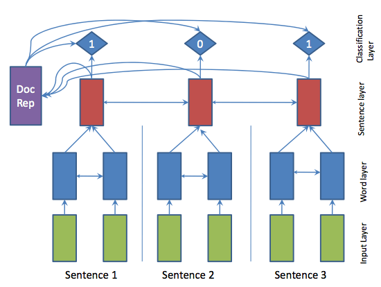

1. Make sentence feature (vector) by Bi-directional LSTM from word vectors (word2vec).
2. Make document feature by Bi-directional LSTM from sentence vectors (`1`).
3. Calculate selection probability from `1` & `2`.

#### Topic Base

The topic base model calculates the topic of the document and evaluate each sentences by what kinds of topics are included (the "main" topic is highly evaluated when scoring the sentence).

Latent Semantic Analysis (LSA) is usually used to detect the topic. It's based on SVD (Singular Value Decomposition).   
The following paper is good starting point to overview the LSA(Topic) base summarization.

[Text summarization using Latent Semantic Analysis](https://www.researchgate.net/publication/220195824_Text_summarization_using_Latent_Semantic_Analysis)

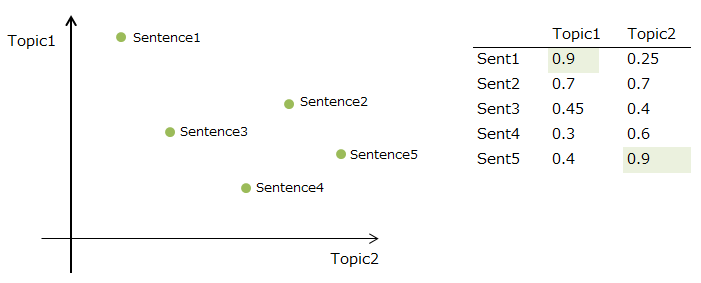  
*The simple LSA base sentence selection*

There are many variations the way to calculate & select the sentence according to the SVD value. To select the sentence by the topic(=V, eigenvectors/principal axes) and its score is most simple method.

If you want to use LSA, gensim supports it.

* [gensim models.lsimodel](https://radimrehurek.com/gensim/models/lsimodel.html)

#### Grammer Base

The grammer base model parses the text and constructs a grammatical structure, then select/reorder substructures.

[Title Generation with Quasi-Synchronous Grammar](https://www.aclweb.org/anthology/D/D10/D10-1050.pdf)

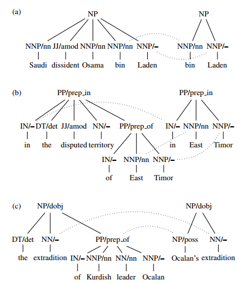

This model can produce meaningful "paraphrase" based on the grammatical structure. For example, above image shows the phrase "in the disputed territory of East Timor" is converted to "in East Timor". To analyze grammatical structure is useful to reconstruct the phrase with keeping its meaning.

#### Neural Network Base

The main theme of extractive summarization by Neural Network is following two point.

1. How to get good sentence representation.
2. How to predict the selection of sentence.

1 is encoding problem, 2 is objective function problem. These are summarized at [A Survey on Neural Network-Based Summarization Methods](https://arxiv.org/abs/1804.04589).

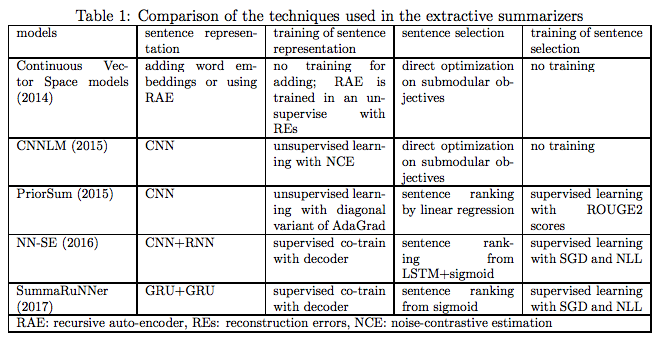

### Abstractive

* Generate a summary that keeps original intent. It's just like humans do.
  * Pros: They can use words that were not in the original input. It enables to make more fluent and natural summaries.
  * Cons: But it is also a much harder problem as you now require the model to generate coherent phrases and connectors.

Extractive & Abstractive is not conflicting ways. You can use both to generate the summary. And there are a way collaborate with human.

* Aided Summarization
  * Combines automatic methods with human input.
  * Computer suggests important information from the document, and the human decide to use it or not. It uses information retrieval, and text mining way.

The beginning of the abstractive summarization, [Banko et al. (2000)](http://www.anthology.aclweb.org/P/P00/P00-1041.pdf) suggest to use machine translatation model to abstractive summarization model. As like the machine translation model converts a source language text to a target one, the summarization system converts a source document to a target summary.

Nowadays, encoder-decoder model that is one of the neural network models is mainly used in machine translation. So this model is also widely used in abstractive summarization model. [The summarization model that used encoder-decoder model first](http://www.aclweb.org/anthology/N16-1012) achieved state-of-the-art on the two sentence-level summarization dataset, DUC-2004 and Gigaword.

If you want to try the encoder-decoder summarization model, tensorflow offers basic model.

* [Text summarization with TensorFlow](https://research.googleblog.com/2016/08/text-summarization-with-tensorflow.html)

#### Encoder-Decoder Model

The encoder-decoder model is composed of encoder and decoder like its name. The encoder converts an input document to a latent representation (vector), and the decoder generates a summary by using it.

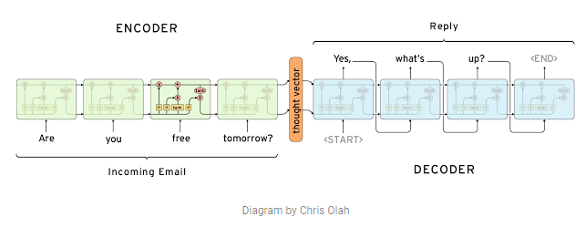  
* from [Computer, respond to this email](https://research.googleblog.com/2015/11/computer-respond-to-this-email.html)*

But the encoder-decoder model is not the silver bullet. There are many remaining issues are there. 

* How to set the focus on the important sentence, keyword.
* How to handle the novel/rare (but important) word in source document.
* How to handle the long document.
* Want to make more human-readable summary.
* Want to use large vocabulary.

##### Researches

**[A Neural Attention Model for Sentence Summarization](https://aclweb.org/anthology/D15-1044)**

* *How to set the focus on the important sentence, keyword.*?
  * use Attention (sec 3.2)
* *How to handle the novel/rare (but important) word in source document.*
  * add n-gram match term to the loss function (sec 5)
* Other features
  * use 1D convolution to capture the local context
  * use beam-search to generate summary
* [Implementation](https://github.com/facebookarchive/NAMAS)

**[Abstractive Text Summarization Using Sequence-to-Sequence RNNs and Beyond](https://arxiv.org/abs/1602.06023)**

* *How to set the focus on the important sentence, keyword.*
  * use enhanced feature such as POS, Named Entity tag, TF, IDF (sec 2.2)
* *How to handle the novel/rare (but important) word in source document.*
  * switch the decoder(generate word) and pointer(copy from original text). (sec 2.3)
* *How to handle the long document.*
  * use sentence level attention (sec 2.4)
* *Want to use large vocabulary.*
  * use subset of vocabulary on the training (sec 2.1, please refer [On Using Very Large Target Vocabulary for Neural Machine Translation](http://www.aclweb.org/anthology/P15-1001))

## Combination Approach

Not only one side of extractive or abstractive, combine them to generate summaries.

### Pointer-Generator Network

Combine the extractive and abstractive model by switching probability.

#### Researches

**[Get To The Point: Summarization with Pointer-Generator Networks](https://arxiv.org/abs/1704.04368)**

* *How to set the focus on the important sentence, keyword.*
  * use Attention (sec 2.1)
* *How to handle the novel/rare (but important) word in source document.*
  * switch the decoder(generator) and pointer network (by `p_gen` probability).
  *  combine the distribution of vocabulary and attention with `p_gen` and (1 - `p_gen`) weight (please refer the following picture).
* [Implementation](https://github.com/abisee/pointer-generator)

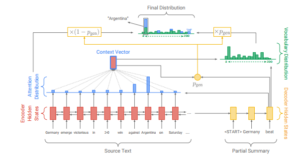

**[A Deep Reinforced Model for Abstractive Summarization](https://arxiv.org/abs/1705.04304)**

* *How to set the focus on the important sentence, keyword.*
  * use intra-temporal attention (attention over specific parts of the encoded input sequence) (sec 2.1)
* How to handle the novel/rare (but important) word in source document.
  * use pointer network to copy input token instead of generating it. (sec 2.3)
* *Want to make more human-readable summary.*
  * use reinforcement learning (ROUGE-optimized RL) with supervised learning. (sec 3.2)
* Other features
  * use intra-decoder attention (attention to decoded context) to supress the repeat of the same phrases. (sec 2.2)
  * constrain duplicate trigram to avoid repetition. (sec 2.5)

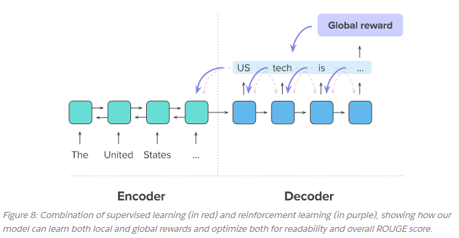

from [Your tldr by an ai: a deep reinforced model for abstractive summarization](https://einstein.ai/research/your-tldr-by-an-ai-a-deep-reinforced-model-for-abstractive-summarization)

The pointer-generator network is theoretically beautiful, but you have to pay attention to its behavior.  
[Weber et al. (2018)](https://arxiv.org/abs/1803.07038) report that a pointer-generator model heavily depends on a "copy" (pointer) at test time.  
[Weber et al. (2018)](https://arxiv.org/abs/1803.07038) use a penalty term for pointer/generator mixture rate to overcome this phenomenon and control the abstractive.

### Extract then Abstract model

Use extractive model to select the sentence from documents, then adopt the abstractive model to selected sentences.

#### Researches

**[Generating Wikipedia by Summarizing Long Sequences](https://arxiv.org/abs/1801.10198)**

* *How to set the focus on the important sentence, keyword.*
  * use the encoder-less self-attention network (sec 4.2.3~). it concatenates input & output, and predict the next token from the previous sequence.
* *How to handle the long document.*
  * use the extractive model to extract tokens from long document first, then execute the abstractive model.

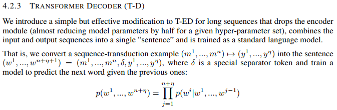

**[Query Focused Abstractive Summarization: Incorporating Query Relevance, Multi-Document Coverage, and Summary Length Constraints into seq2seq Models](https://arxiv.org/abs/1801.07704)**

This model combines query focused extractive model and abstractive model. Extract sentence and calculate the relevance score of each word according to the query, then input it to pre-trained abstractive model.

* *How to set the focus on the important sentence, keyword.*
  * use attention and query relevance score
* *How to handle the long document.*
  * use query to extract document/sentences from multiple documents.

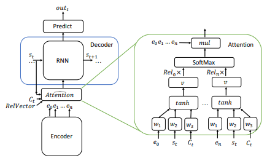

**[Fast Abstractive Summarization with Reinforce-Selected Sentence Rewriting](https://arxiv.org/abs/1805.11080)**

The extractor is reinforcement-learning agent, and the abstractor rewrites selected sentence.

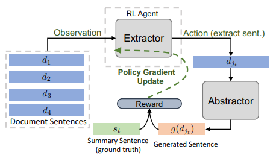

* How to set the focus on the important sentence, keyword.
  * implements the Extractor by CNN-then-RNN model (Figure 1), and train it by ROUGE score.
* How to handle the novel/rare (but important) word in source document.
  * use copy mechanism

## Transfer Learning

It'll be useful to reuse the learned model to make a new summarization model. That's called "Transfer Learning". It enables making the model by few data and short time. This feature leads to domain-specific summarization by a few data/short time.

#### Researches

[BERT](https://arxiv.org/abs/1810.04805) is the representative model that enables getting good representation of sentences. Several methods are proposed to create summaries by BERT.

**[Fine-tune BERT for Extractive Summarization](https://arxiv.org/abs/1903.10318)**

* How to use the pre-trained model?
  * Getting good sentence representation.
  * BERT generates token based feature. Therefore there is a need to convert token based to sentence based representation. They use "Segmentation Embedding" to recognize sentence boundary and use the first token of segmentation as sentence embedding.

**[Pretraining-Based Natural Language Generation for Text Summarization](https://arxiv.org/abs/1902.09243)**

* How to use the pre-trained model?
  * Getting good sentence representation and refine a generated sentence. 
  * BERT is trained to predict the masked token, so can't generate a sequence. In this research, the first summarization is generated by an ordinary transformer model, and then drop some tokens to filling it by BERT. Final summarization is created by input BERT representation and complemented (refined) sentence representation by BERT.

## Evaluation

### [ROUGE-N](https://en.wikipedia.org/wiki/ROUGE_(metric))

Rouge-N is a word N-gram count that matche between the model and the gold summary. It is similart to the "recall" because it evaluates the covering rate of gold summary, and not consider the not included n-gram in it.

ROUGE-1 and ROUGE-2 is usually used. The ROUGE-1 means word base, so its order is not regarded. So "apple pen" and "pen apple" is same ROUGE-1 score. But if ROUGE-2, "apple pen" becomes single entity so "apple pen" and "pen apple" does not match. If you increase the ROUGE-"N" count, finally evaluates completely match or not.

### [BLEU](http://www.aclweb.org/anthology/P02-1040.pdf)

BLEU is a modified form of "precision", that used in machine translation evaluation usually. BLEU is basically calculated on the n-gram co-occerance between the generated summary and the gold (You don't need to specify the "n" unlike ROUGE). 

## Resources

### Datasets

* [DUC 2004](http://www.cis.upenn.edu/~nlp/corpora/sumrepo.html)
* [Opinosis Dataset - Topic related review sentences](http://kavita-ganesan.com/opinosis-opinion-dataset)
* [17 Timelines](http://www.l3s.de/~gtran/timeline/)
* [Legal Case Reports Data Set](http://archive.ics.uci.edu/ml/datasets/Legal+Case+Reports)
* [Annotated English Gigaword](https://catalog.ldc.upenn.edu/LDC2012T21)
* [CNN/Daily Mail dataset](https://cs.nyu.edu/~kcho/DMQA/)
  * It is originally Q&A dataset, but its `stories` are commonly used as summarization dataset (you can download preprocessed dataset from [here](https://github.com/abisee/cnn-dailymail)).
* [CORNELL NEWSROOM](https://summari.es/)
  * It is one of the huge summarization dataset! This dataset contains 1.3 million articles and summaries written by authors and editors in the newsrooms of 38 major publications.

### Libraries

* [gensim](https://radimrehurek.com/gensim/index.html)
  * [`gensim.summarization`](https://radimrehurek.com/gensim/summarization/summariser.html) offers TextRank summarization
  * [`gensim models.lsimodel`](https://radimrehurek.com/gensim/models/lsimodel.html) offers topic model
* [pytextrank](https://github.com/ceteri/pytextrank)
* [TextTeaser](https://github.com/MojoJolo/textteaser) 
  * [PyTeaser](https://github.com/xiaoxu193/PyTeaser) for Python user
* [TensorFlow summarization](https://github.com/tensorflow/models/tree/master/research/textsum)
* [sumeval](https://github.com/chakki-works/sumeval)
  * Calculate ROUGE and BLEU score

### Articles

* Wikipedia
  * [Automatic summarization](https://en.wikipedia.org/wiki/Automatic_summarization)
* Blogs
  * [Text summarization with TensorFlow](https://research.googleblog.com/2016/08/text-summarization-with-tensorflow.html)
  * [Your tl;dr by an ai: a deep reinforced model for abstractive summarization](https://einstein.ai/research/your-tldr-by-an-ai-a-deep-reinforced-model-for-abstractive-summarization)

### Papers

#### Overview

1. A. Nenkova, and K. McKeown,  "[Automatic summarization](https://www.cis.upenn.edu/~nenkova/1500000015-Nenkova.pdf),". Foundations and Trends in Information Retrieval, 5(2-3):103–233, 2011.
2. K. Sparck Jones, “[Automatic summarizing: factors and directions](https://www.cl.cam.ac.uk/archive/ksj21/ksjdigipapers/summbook99.pdf),”. Advances in Automatic Text Summarization, pp. 1–12, MIT Press, 1998.
3. Y. Dong, "[A Survey on Neural Network-Based Summarization Methods](https://arxiv.org/abs/1804.04589),". arXiv preprint arXiv:1804.04589, 2018.

#### Extractive Summarization

1. R. Mihalcea, and P. Tarau, "[Textrank: Bringing order into texts](https://web.eecs.umich.edu/~mihalcea/papers/mihalcea.emnlp04.pdf),". In Proceedings of the 2004 Conference on Empirical Methods in Natural Language Processing, 2004. 
2. G. Erkan, and D. R. Radev, "[LexRank: graph-based lexical centrality as salience in text summarization](https://www.aaai.org/Papers/JAIR/Vol22/JAIR-2214.pdf),". Journal of Artificial Intelligence Research, v.22 n.1, p.457-479, July 2004.
3. J. Jagadeesh, P. Pingali, and V. Varma, "[Sentence Extraction Based Single Document Summarization](http://oldwww.iiit.ac.in/cgi-bin/techreports/display_detail.cgi?id=IIIT/TR/2008/97)", Workshop on Document Summarization, 19th and 20th March, 2005.
4. P.H. Luhn, "[Automatic creation of literature abstracts](http://courses.ischool.berkeley.edu/i256/f06/papers/luhn58.pdf),". IBM Journal, pages 159-165, 1958.
5. M. G. Ozsoy, F. N. Alpaslan, and I. Cicekli, "[Text summarization using Latent Semantic Analysis](https://www.researchgate.net/publication/220195824_Text_summarization_using_Latent_Semantic_Analysis),". Proceedings of the 23rd International Conference on Computational Linguistics, vol. 37, pp. 405-417, aug 2011.
6. K. Woodsend, Y. Feng, and M. Lapata, "[Title generation with quasi-synchronous grammar](https://www.aclweb.org/anthology/D/D10/D10-1050.pdf),". Proceedings of the 2010 Conference on Empirical Methods in Natural Language Processing, p.513-523, October 09-11, 2010.
7. R. Nallapati, F. Zhai and B. Zhou, "[SummaRuNNer: A Recurrent Neural Network based Sequence Model for Extractive Summarization of Documents](https://arxiv.org/abs/1611.04230),". In AAAI, 2017.

#### Abstractive Summarization

1. M. Banko, V. O. Mittal, and M. J. Witbrock, "[Headline Generation Based on Statistical Translation](http://www.anthology.aclweb.org/P/P00/P00-1041.pdf),". In Proceedings of the 38th Annual Meeting on Association for Computational Linguistics, pages 318–325. Association for Computational Linguistics, 2000. 
2. A. M. Rush, S. Chopra, and J. Weston, "[A Neural Attention Model for Abstractive Sentence Summarization](https://arxiv.org/abs/1509.00685),". In EMNLP, 2015.
   * [GitHub](https://github.com/facebookarchive/NAMAS)
3. S. Chopra, M. Auli, and A. M. Rush, "[Abstractive sentence summarization with attentive recurrent neural networks](http://www.aclweb.org/anthology/N16-1012),". In North American Chapter of the Association for Computational Linguistics, 2016.
4. R. Nallapati, B. Zhou, C. dos Santos, C. Gulcehre, and B. Xiang, "[Abstractive text summarization using sequence-to-sequence RNNs and beyond](https://arxiv.org/abs/1602.06023),". In Computational Natural Language Learning, 2016.
5. S. Jean, K. Cho, R. Memisevic, and Yoshua Bengio. "[On using very large target vocabulary for neural machine translation](http://www.aclweb.org/anthology/P15-1001),". CoRR, abs/1412.2007. 2014.

#### Combination

1. A. See, P. J. Liu, and C. D. Manning, "[Get to the point: Summarization with pointergenerator networks](https://arxiv.org/abs/1704.04368),". In ACL, 2017.
   * [GitHub](https://github.com/abisee/pointer-generator)
2. N. Weber, L. Shekhar, N. Balasubramanian, and K. Cho, "[Controlling Decoding for More Abstractive Summaries with Copy-Based Networks](https://arxiv.org/abs/1803.07038),". arXiv preprint arXiv:1803.07038, 2018.
3. R. Paulus, C. Xiong, and R. Socher, "[A deep reinforced model for abstractive summarization](https://arxiv.org/abs/1705.04304),". arXiv preprint arXiv:1705.04304, 2017.
4. P. J. Liu, M. Saleh, E. Pot, B. Goodrich, R. Sepassi, L. Kaiser, and N. Shazeer, "[Generating Wikipedia by Summarizing Long Sequences](https://arxiv.org/abs/1801.10198),". arXiv preprint arXiv:1801.10198, 2018.
5. T. Baumel, M. Eyal, and M. Elhadad, "[Query Focused Abstractive Summarization: Incorporating Query Relevance, Multi-Document Coverage, and Summary Length Constraints into seq2seq Models](https://arxiv.org/abs/1801.07704),". arXiv preprint arXiv:1801.07704, 2018.
6. Y. Chen, M. Bansal, "[Fast Abstractive Summarization with Reinforce-Selected Sentence Rewriting](https://arxiv.org/abs/1805.11080),". In ACL, 2018.

## Transfer Learning

1. Y. Liu. "[Fine-tune BERT for Extractive Summarization](https://arxiv.org/abs/1903.10318),". arXiv preprint arXiv:1903.10318, 2019.
2. H. Zhang, J. Xu and J. Wang. "[Pretraining-Based Natural Language Generation for Text Summarization](https://arxiv.org/abs/1902.09243),". arXiv preprint arXiv:1902.09243, 2019.
